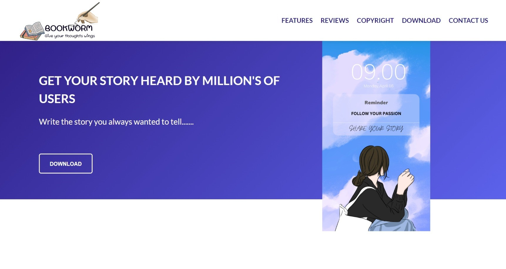
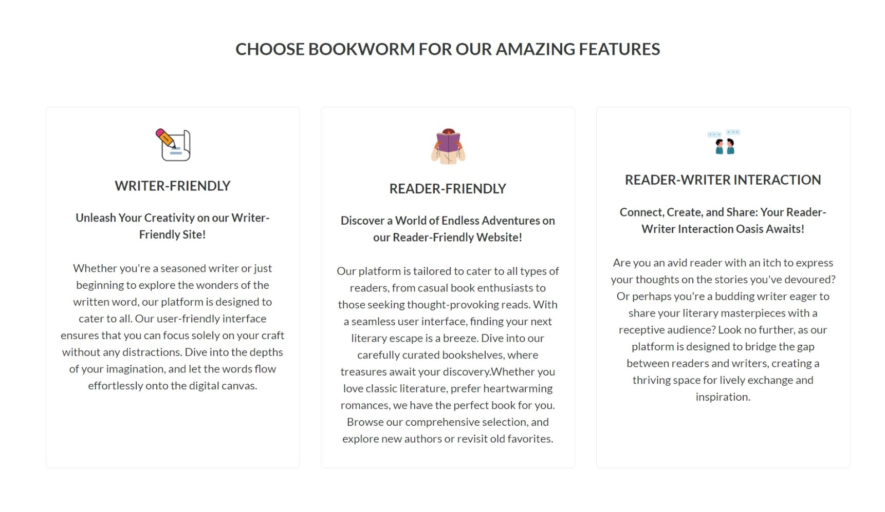
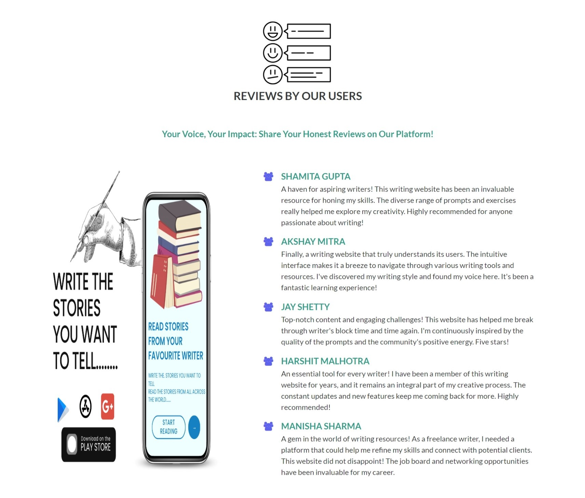
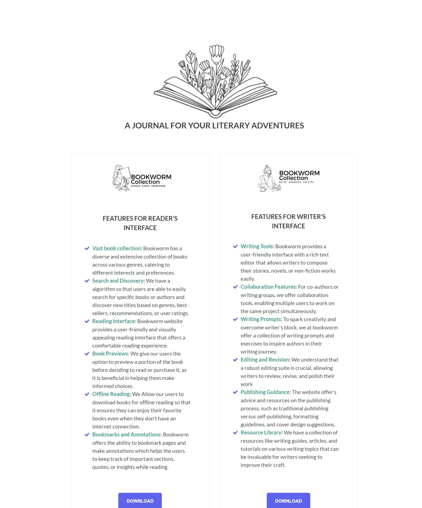
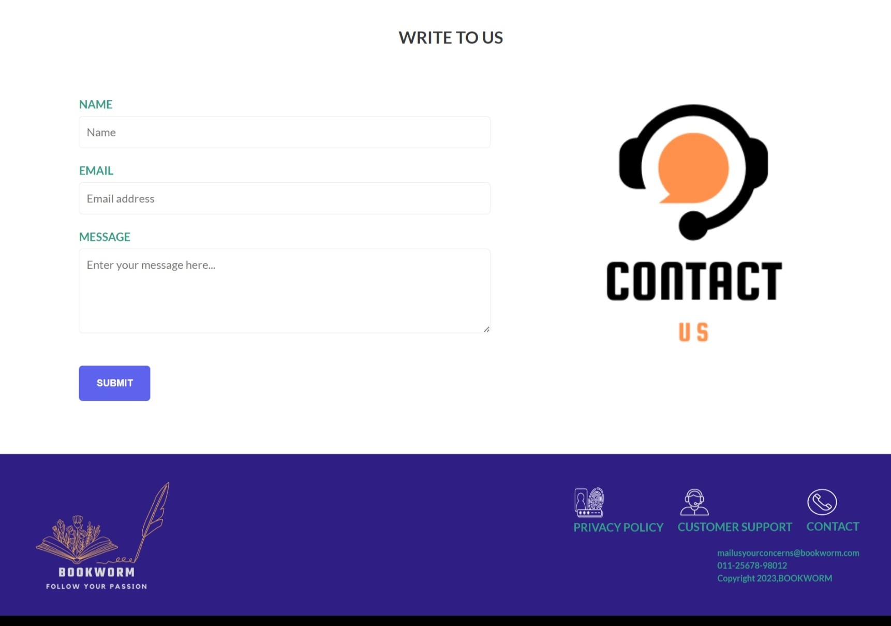

# CODSOFT
Repository for codsoft internship
Bookworm" is a captivating web project that showcases my passion for literature and programming prowess. Utilizing HTML and CSS, I have crafted an immersive online platform dedicated to the world of books and reading. The website's intuitive design and responsive layout provide an enchanting user experience, drawing visitors into a literary wonderland. With carefully curated bookshelves displaying diverse genres and captivating cover art, users can explore a rich collection of literary masterpieces. The combination of HTML's structure and CSS's stylistic enhancements brings life to each page, creating a visually appealing and interactive reading environment. Bookworm not only celebrates the joy of reading but also serves as a testament to the seamless integration of technology and creativity.
# WEBSITE PREVIEW

